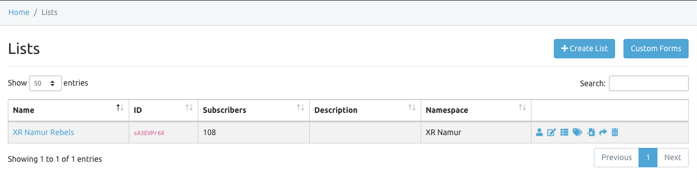
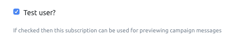
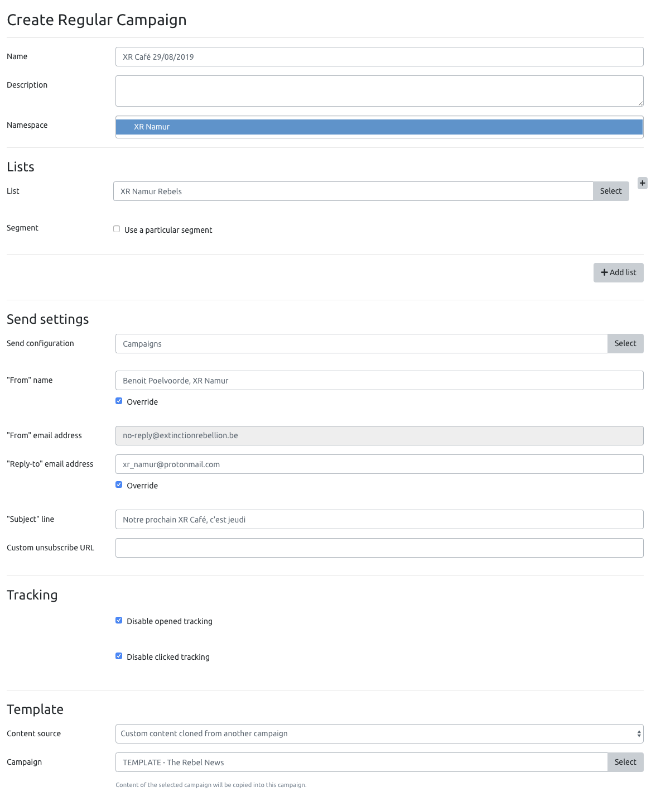
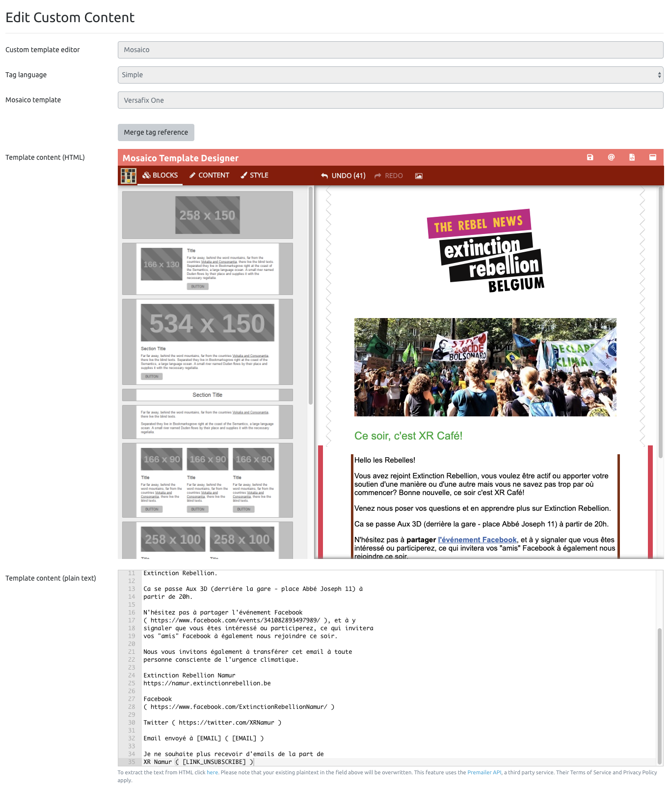
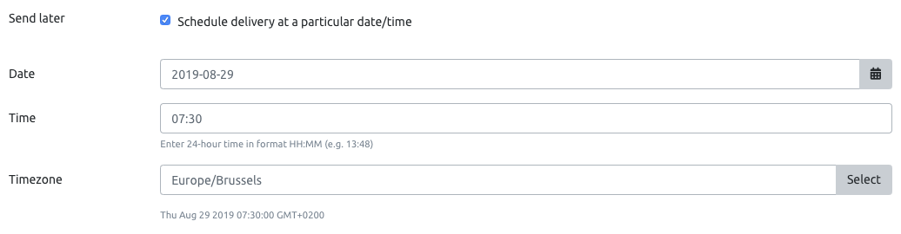

# Sending emails

If you are a group coordinator, we strongly advise you not to use Protonmail to email "newsletters-like" emails.


On a Protonmail _**Free**_ plan, the sending limit is fixed to 50 messages/hour and 150 messages/day. If you go over these limits, you will have to wait before being able to send emails again.


All local groups and XR Belgium working groups have credentials to Mailtrain. This is a self-hosted newsletter application, similar to Mailchimp in the way that it allows to email lists of subscribers.

## Lists

The _Rebels_ list is synchronized with the Rebels Manager.

* A subscription is created when a rebel signs up to your local group, either from the website or manually added by a coordinator
* A subscription is updated when the rebel email address is updated on the Rebels Manager
* A subscription is deleted when a rebel is deleted on the Rebels Manager


Please **don't** edit the list config for now. But feel free to add missing email addresses that you have on your side and that were not being added because they aren't in the Rebels Manager yet.


You may create other lists \(eg. one for a specific working group\). In the future, we will have synchronized lists for all working groups.

### Specifying test emails

This is useful to send test emails to yourself. Find your own subscription \(or add one\) in the Subscribers list, edit it and check the _Test user?_ box.

Then click the _Save and leave_ button.

## Campaigns

This is where you go to send an email to your list.

### Set up the campaign

On the screenshot above, you see a few important things:

* Select the right list
* Send configuration: always select _Campaigns_
* "From" name: we recommend you to set it to "XR City" or even better for deliverability, to your name/coordinator name like "Benoit Poelvoorde, XR Namur"
* "Reply-to" email address: set it to your group email address so that you can receive replies
* "Subject" line: don't forget it!
* Tracking: disable tracking for better deliverability
* Template: use the "Rebels News" template
  * Content source: Custom content from another campaign
  * Campaign: TEMPLATE - The Rebel News

### Edit content

This is where the fun begins! 🕺🏽

We will explain this editor in details in the future, but for now, here are our main recommendations for you.

* The more you will use it, the easier it will be
* Play with the blocks \(drag and drop them\) or use the existing ones, that you can move/delete/duplicate
* When your template is ready, click the tiny "click here" button below the _plain text_ content box. This will import the email content as text and will improve deliverability.

#### Test it!

We recommend that you send a test email to yourself before sending your first emails to your lists. Click the _Test send_ green button and select your email as shown below.

If your email is not available, you are not a Test user yet. Save your campaign \(you will come back to it later\), go back to your lists and add yourself as a test user \(see above\).

#### All good?

Then click the _Save and go to status_ button. Your email has not been sent yet.

### Send now or schedule delivery

From the Status page, you can yet get a preview of your email \(the URL can be shared with anyone else\), send a new test email and finally _Send_ it or _Schedule_ it for later.

All done! Congrats! 🎉


Mailtrain 2 is brand new and **your feedback is valuable**. Please get in touch with the Support team on our [\#mailtrain](https://organise.earth/xrbelgium/channels/mailtrain) Mattermost channel, and let us know about your experience on Mailtrain.


