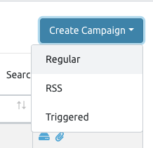
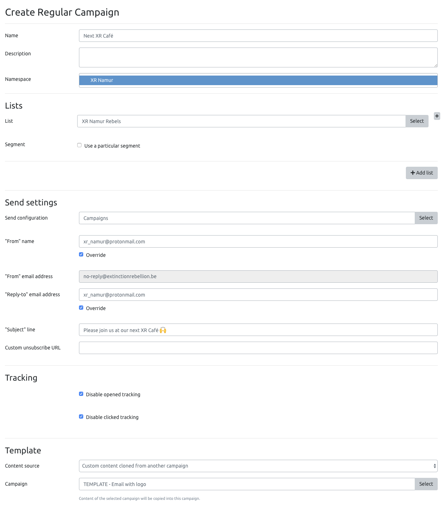
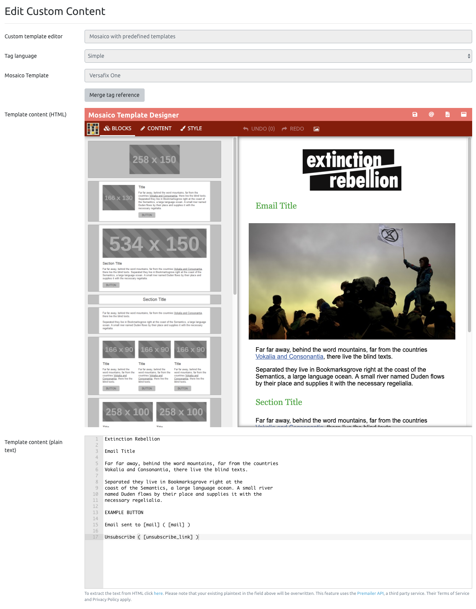
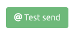
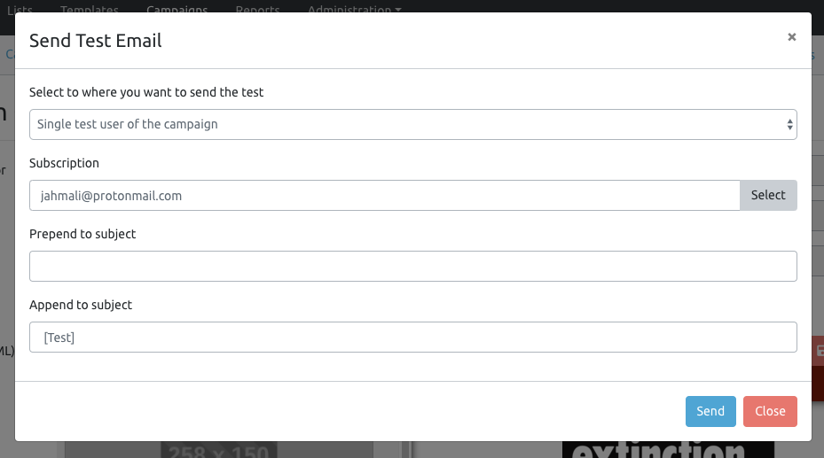
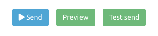

# Sending emails

If you are a group coordinator, we strongly advise you not to use Protonmail to email a bunch of people, except if you need end-to-end encryption \(eg. for discussing a planned action\).

All local groups and XR Belgium working groups have credentials to Mailtrain. This is a self-hosted newsletter application, similar to Mailchimp in the way that it allows to email lists of subscribers.

## Lists

The _Rebels_ list is synchronized with the Rebels Manager.

* A subscription is created when a rebel signs up to your local group, either from the website or manually added by a coordinator
* A subscription is updated when the rebel email address is updated on the Rebels Manager
* A subscription is deleted when a rebel is deleted on the Rebels Manager


Please **don't** edit the list config for now.


You may create other lists. In the future, we may have synchronized lists for all working groups.

### Specifying test emails

This is useful to send test emails to yourself. Find your subscription is the Subscribers list, edit it and check the _Test user?_ box.

Then click the _Save and leave_ button.

## Campaigns

This is where you go to send an email to your list.

Then click the _Save and go to status_ button. Your email has not been sent yet.

You can yet get a preview of your email, send a new test email and finally _Send_ it.

Congrats! 🎉


Mailtrain 2 is brand new and **your feedback is valuable**. Please get in touch with the Support team on our [\#mailtrain](https://organise.earth/xrbelgium/channels/mailtrain) Mattermost channel, and let us know about your experience on Mailtrain.


