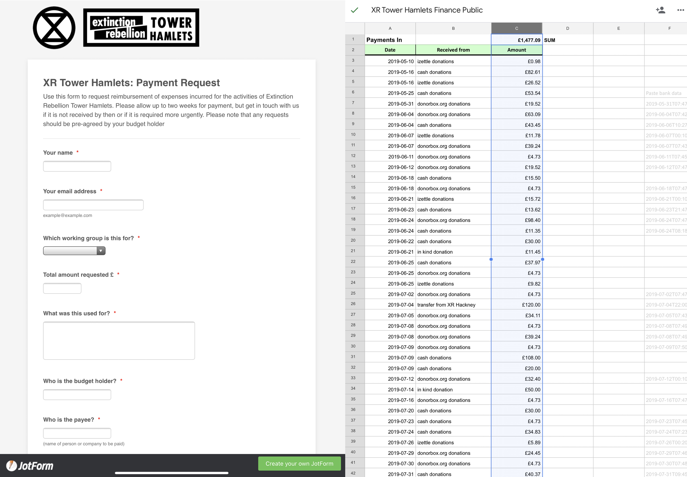
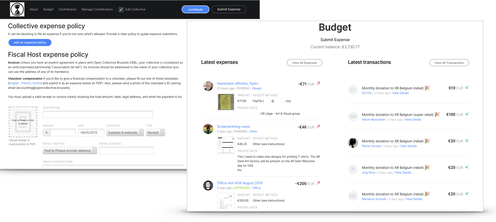

# Expense management

Transparency is important, especially when it comes to money. Learn what you need to put in place to make sure you keep a good financial hygiene from day one.

## Expense policy

It’s important to have an expense policy that anyone can easily consult. This makes sure that there are clear rules and that all rebels are treated the same way \(and in a fair way\). See the section [Expense Policy](expense-policy.md).

## Public record

At any point, anyone should be able to see how much money you have, what you have spent it on and how much is left. If they can’t, people will start fantasizing about different scenarios \(corruption, plots, abuse, etc.\). The best way to avoid that is to be able to point them to a page that is easily accessible and that is always up to date with the latest transactions.

There are two other benefits from keeping a public record:

**It helps rebels know what can be expensed**  
Even though you may have a very thorough [Expense Policy](expense-policy.md), let’s be honest, most people don’t read the manual \(don’t forget, you are dealing with rebels\). They look at past behavior and they quickly find out how things work. By looking at your public record, rebels will quickly get a pretty good idea of what can be expensed and for how much.

**It helps rebels organize new actions**  
Rebels come and go and also change roles. It’s important for new rebels to be able to see how much has been spent on previous actions to give them an idea of how much it costs to run this or that action. What were the most expensive costs that can maybe be avoided in the future? What materials have been already purchased that can be reused?


In some regions, it might be advisable to not record the identity of the rebels that donated money or that used some of the money. You can instead use pseudonyms.


### How to create a public record?

The easiest and most straightforward way is to create a shared Google Spreadsheet. Here is XR Tower Hamlets‘s [public record of expenses](https://docs.google.com/spreadsheets/d/1mjOjGr8ZjCCJkGfLZ5lZU342KCbS105o1oCjsu4IdkU/edit#gid=0).

Alternatively, you can create an [Open Collective](tools.md#open-collective) for your XR group. It will give you an url that you can share with your community to submit expenses \(with a picture of the receipt\) and a simple approval process. See for example [XR Hackney’s public record of expenses](https://opencollective.com/xrhackney/expenses) or [XR Belgium’s one](https://opencollective.com/xr-belgium/expenses).

You can also use professional accounting software such as [Xero](../) or [QuickBooks](https://quickbooks.intuit.com/). Note that those software have been engineered for private companies. You will have to export the data regularly and publish it in a user friendly format to make it accessible to people.

## Case studies

### XR Tower Hamlets

They built a [custom form](https://form.jotformeu.com/91277648344365) using [JotForm](https://jotform.com) \(free for up to 100 submissions per month, then $15.83/month\). They then record them in this [Google Spreadsheet](https://docs.google.com/spreadsheets/d/1mjOjGr8ZjCCJkGfLZ5lZU342KCbS105o1oCjsu4IdkU/edit#gid=0). Their expense policy is available as a [Google Doc](https://docs.google.com/document/d/1Zx5JWNgjfHyAuqw6DILdPfpXHJ_L0bTZLbMqPtPM89Y).

### XR Belgium

XR Belgium is using [Open Collective](tools.md#open-collective) \([https://opencollective.com/XR-Belgium](https://opencollective.com/XR-Belgium)\).

Every time anyone needs money, they simply submit the expense or the invoice of the vendor to the collective. An email is automatically sent to the different admins of the collective that can then easily approve or comment on the expense to ask for more information. All expenses and their status are automatically published online \([https://opencollective.com/XR-belgium/expenses](https://opencollective.com/XR-belgium/expenses)\). Note that the actual receipts and invoices are only visible to the admins as they may contain personal data.

All the transactions can also be exported in CSV and programmatically via their [API](https://docs.opencollective.com/help/developers/api).

