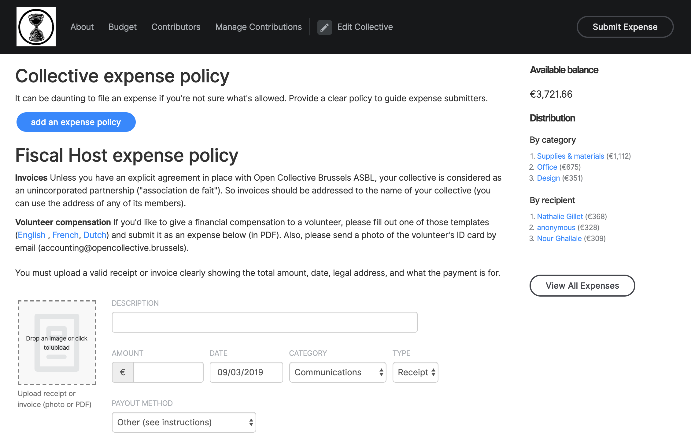

# Expense policy

### Why an expense policy?

It's important to have a public expense policy so that rebels can know in advance what can be expensed. Also, you need a public document that you can go back to to justify why you are accepting or refusing a given expense. This makes sure that decisions are fair for everyone.

### What should be in an expense policy?

* What type of expenses can be submitted
  * Can rebels expense their public transport tickets?
  * ...
* Decision making process to approve them
  * Light process for small amounts?
  * Is there an amount above which the decision process should be different?

### Where to publish it?

Wherever the rebels might look for information about your finance; on your website on the page where you ask for donations, in your vade mecum \(aka onboarding handbook\), ... 

If you use Open Collective, you can write a summary of your expense policy that will show up right above the form to submit an expense \(and you can add a link to the more complete expense policy if it's a long one\).

### Examples

* [XR Hackney Expense Policy](https://docs.google.com/document/d/1b7xF8gJ2KxzG6oNOPATfcMNFlEic6NcNqw308XKraF8/mobilebasic)
* [XR Tower Hamlets Expense Policy](https://docs.google.com/document/d/1Zx5JWNgjfHyAuqw6DILdPfpXHJ_L0bTZLbMqPtPM89Y/edit)

