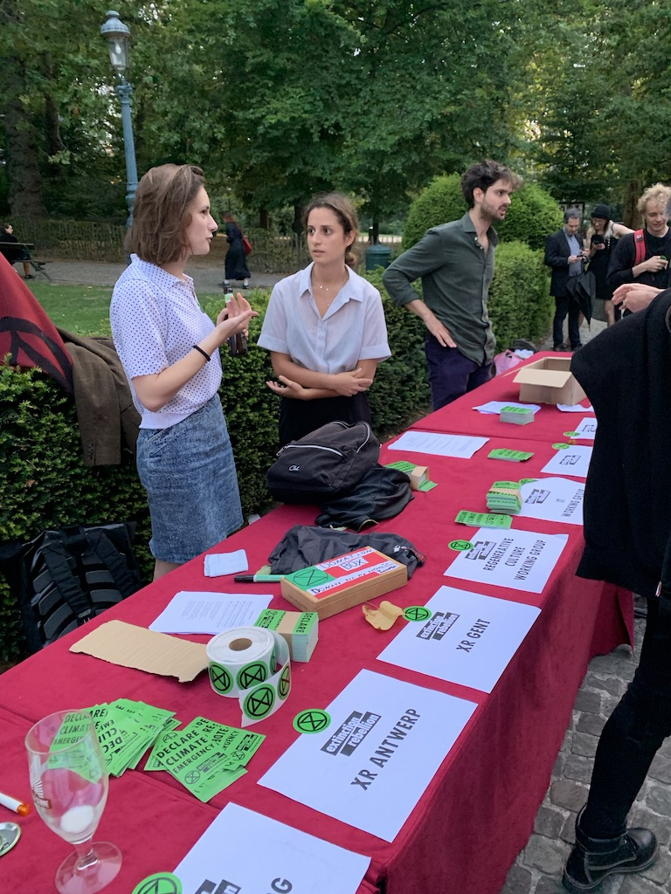

# Offline fundraising

## Meetings

It's always a good idea to pass a donation box. Just make sure to share the message that it is optional. Nobody should ever feel pressured to donate to attend an XR meeting.

> "We usually get £50 or so - that’d be from 40 people"  
> – David Wilkins \(XR Hammersmith and Fulham\)

## Talks

At the talk of Roger Hallam in Brussels \(August 2019\), we passed a donation box –church style– and we collected €275 \(with about 170 people in the room\).

## Food

> "From Bristol's experience, I can't stress the importance of food and block printing/general arts and crafts activities. Regardless of what event you're doing, having some free food will make people 10x more likely to donate and donate more."  
> – James \(XR Bristol\)

## Links

* [70+ Unique Fundraising Ideas For Successful Events](https://www.eventbrite.co.uk/blog/unique-fundraising-event-ideas-ds00/)

